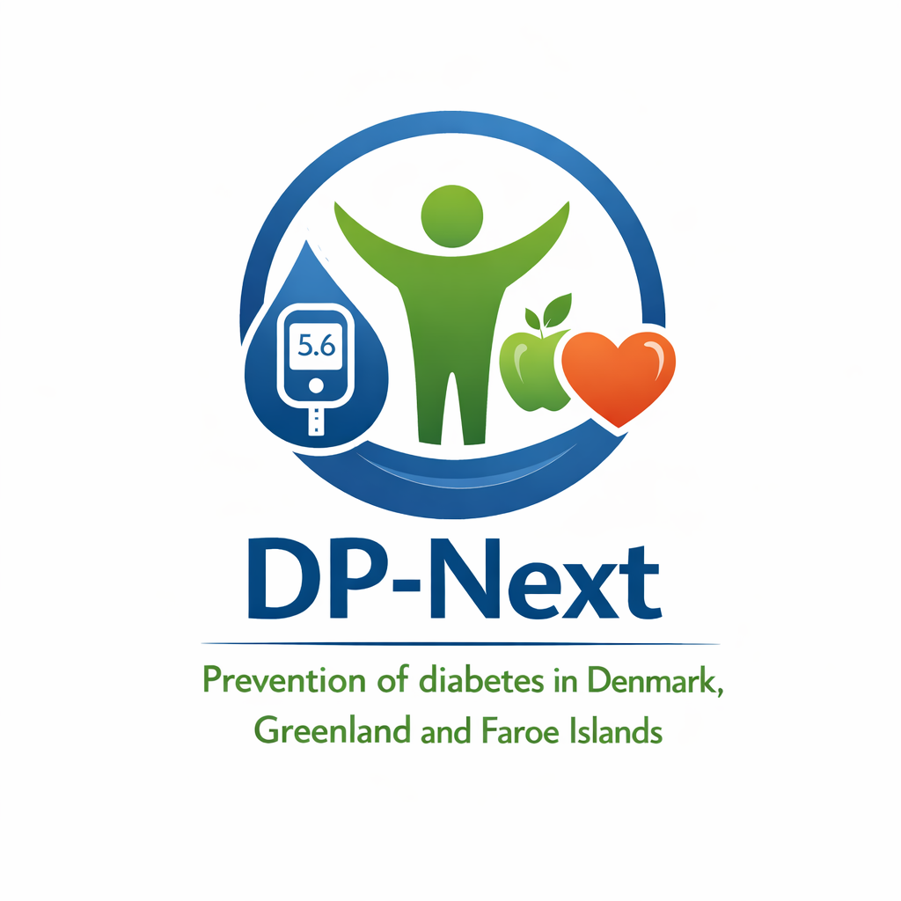

## About the project

The DP-Next project aims to develop the NEXT generation of Diabetes Prevention strategies for Denmark, Greenland and the Faroe Islands. It is a collaboration between all 7 Steno Diabetes Centers. This page provides information for people who have been asked to participate by [completing a questionnaire](en/participant-questionnaire.qmd) or by attending a [clinical examination](en/participant-clinical.qmd).

## Learn more

You can read more about the project (in English) on the [DP-Next website](https://dp-next.github.io/).

You can also listen to a podcast about the project (in Danish): [Forskere vil forsinke udvikling af type 2-diabetes: (2026) Host: Diabetesforskerne](https://open.spotify.com/episode/3WmBVyNdqTDAMZ4KLPJDZF?si=_mKZYWQFQkKbLufQy-ELSg)
